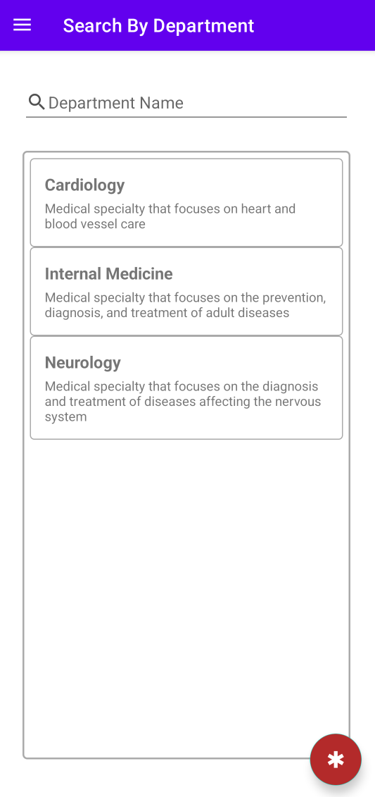
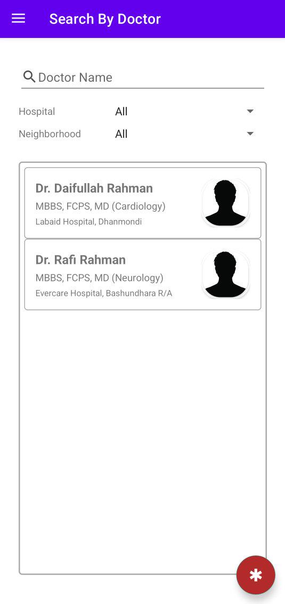

# MedFinder

MedFinder is an Android application that allows users to search for healthcare providers. Users can search for doctors by name or by department.

## Features

- Search for doctors by name and location
- Search for doctors by department
- Navigation drawer for easy access to different sections
- User profile section in the navigation drawer
- Doctor profile section with contact information

## Screenshots






## Installation

1. Clone the repository:
    ```sh
    git clone https://github.com/Blinkfrosty/MedFinder.git
    ```
2. Open the project in Android Studio.
3. Build the project and run it on an Android device or emulator.

## Usage

1. Open the app.
2. Use the navigation drawer to select "Search By Department" or "Search By Doctor".
3. Enter the search criteria and view the results.

## Project Structure

- `app/src/main/java/com/blinkfrosty/medfinder/` - Contains the main Java source files.
- `app/src/main/res/layout/` - Contains the XML layout files.
- `app/src/main/res/values/` - Contains the resource values such as strings and dimensions.
- `app/src/main/res/mipmap-anydpi/` - Contains the app launcher icons.

## Dependencies

- [AndroidX](https://developer.android.com/jetpack/androidx)
- [Material Components for Android](https://material.io/develop/android)

## License

This project is licensed under the MIT License.